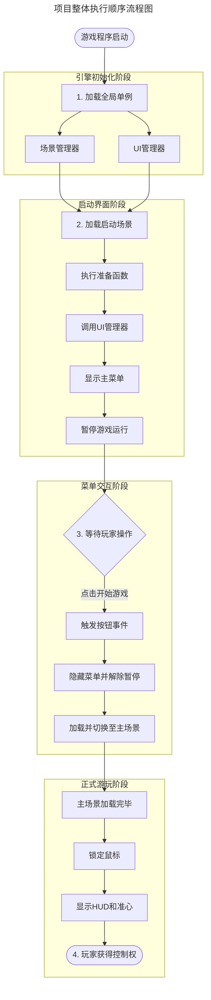

# 文档结构怎么布局
	- 综合使用场景树、节点和组件(代码)，尽量做到功能不绑定特定对象，实现最大化的复用和易维护
		- 特定功能写成单独组件，挂在指定对象上，并通过信号连接
	- 文件夹命名，尽量按照类别和功能区分，提取一个文件夹时，能一次性提取特定功能

# 玩家死亡后，相机怎么不跟随注销
	- 保证相机不会随玩家注销而注销
		- 相机不挂在玩家节点下
		- 动态生成相机节点，并移动到相应位置
	- 相机节点树怎么样的？
		- 玩家(CharacterBody3D)：视角主人
		- 相机支点(Node3D)：控制相机变换的，包含位置，旋转
		- 弹簧臂(SpringArm3D)：处理相机跟随,设置相机与玩家间距，避免穿模
		- 相机同步器(RemoteTransform3D)：把远程相机的路径绑定到玩家视角
		- 主场景（Node3D）：
		- 相机(Camera3D)：相机本身的设置，放入主场景，不会跟随玩家释放而释放
# UI类别是什么，怎么布局？
	- UI界面是除游戏场景文件以外的显示，都属于UI的范畴
	- 依据显示特点分为四类：
		1. HUD层，Head up display，游戏中一直显示的UI，如血量，弹药等
		2. 功能层, 仅需要时显示和隐藏，低频次时间不定，如商城，任务，角色等，一般逻辑复杂，节点众多，盖住HUD层，在首次出现时第一次加载
		3. 系统层, 打断游戏状态时显示，一般是全局界面，比如主菜单，暂停，加载，登陆等，不属于任一个游戏场景，单独管理生命周期，弹出时，盖住HUD和功能层
		4. 弹出层，显示或隐藏非常频繁，处在最上层，比如系统公告，提示，对话框等，复用高，反复使用
# 为什么创建UI实例池？
	- 游戏中等UI创建和销毁等时机不一致，为了避免反复的创建和销毁同一个UI，用一个字典缓存，确保只会创建一次，后边随时取用
### 流程阶段解析：
1. **引擎初始化阶段**：Godot 引擎启动后，第一时间会把“场景管理器”和“UI管理器”这两个勾选了“自动加载”的脚本/节点常驻在内存中，它们在整个游戏生命周期内都不会被销毁。
2. **启动界面阶段**：引擎加载项目设置里指定的第一个场景。场景加载完毕后，`_ready` 函数被触发，命令 UI 管理器弹出主菜单，并把背后的游戏逻辑暂停，防止玩家在看菜单时角色发生移动或受攻击。
3. **菜单交互阶段**：此时由于你的 UI 管理器设置了 `PROCESS_MODE_ALWAYS`（始终处理），所以虽然游戏暂停了，但按钮依然能点击。点击后，程序先恢复游戏运行（解除暂停），然后执行场景切换。
4. **正式游玩阶段**：画面彻底切入到“主场景.tscn”，同时通过代码将鼠标锁定在屏幕中央（`MOUSE_MODE_CAPTURED`），并将鼠标移动的事件传递给输入组件，玩家就可以正常转动视角游玩了。_
### 项目整体执行顺序流程图

